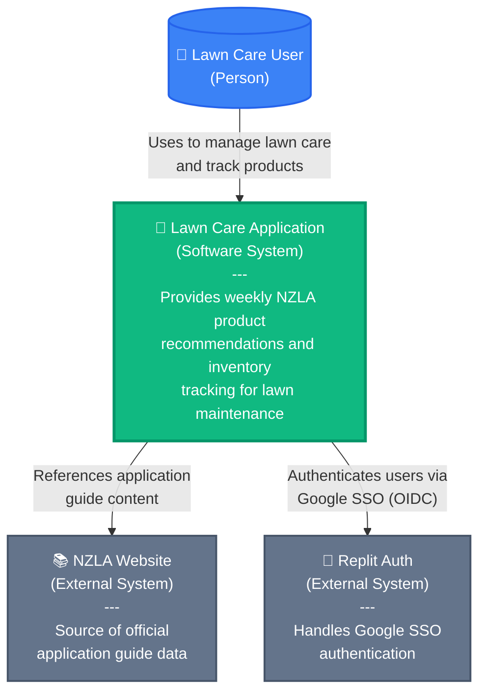
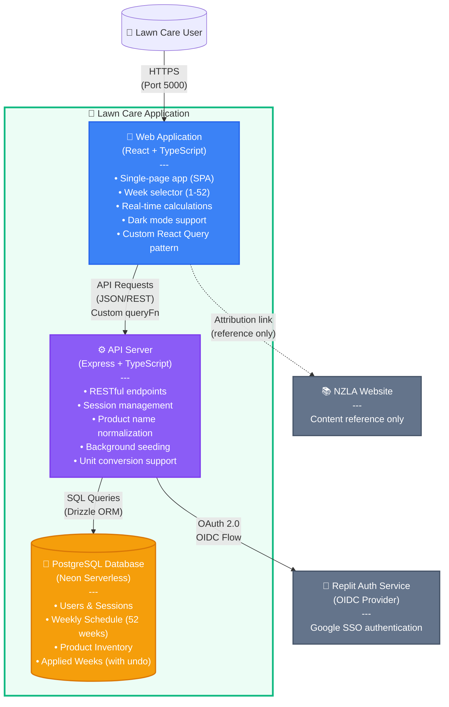
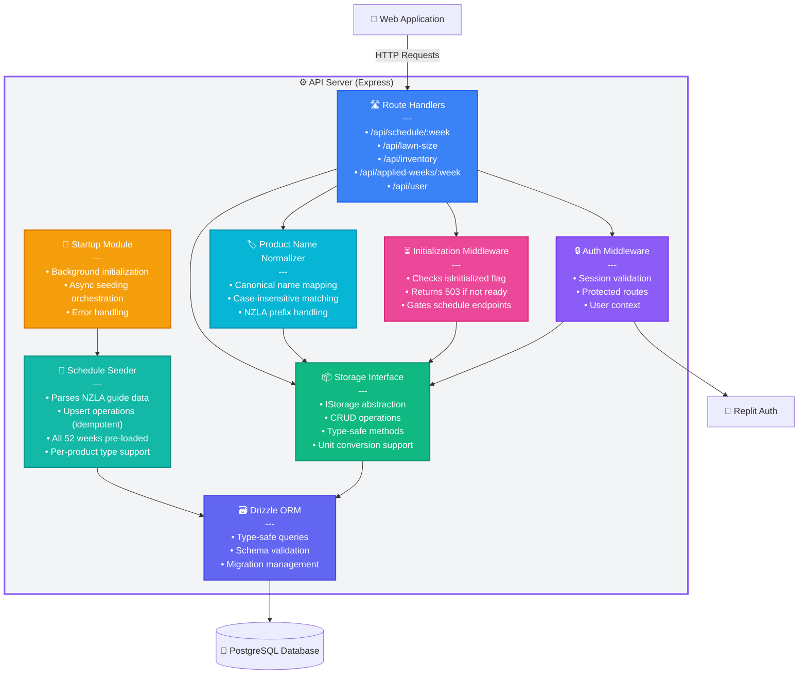
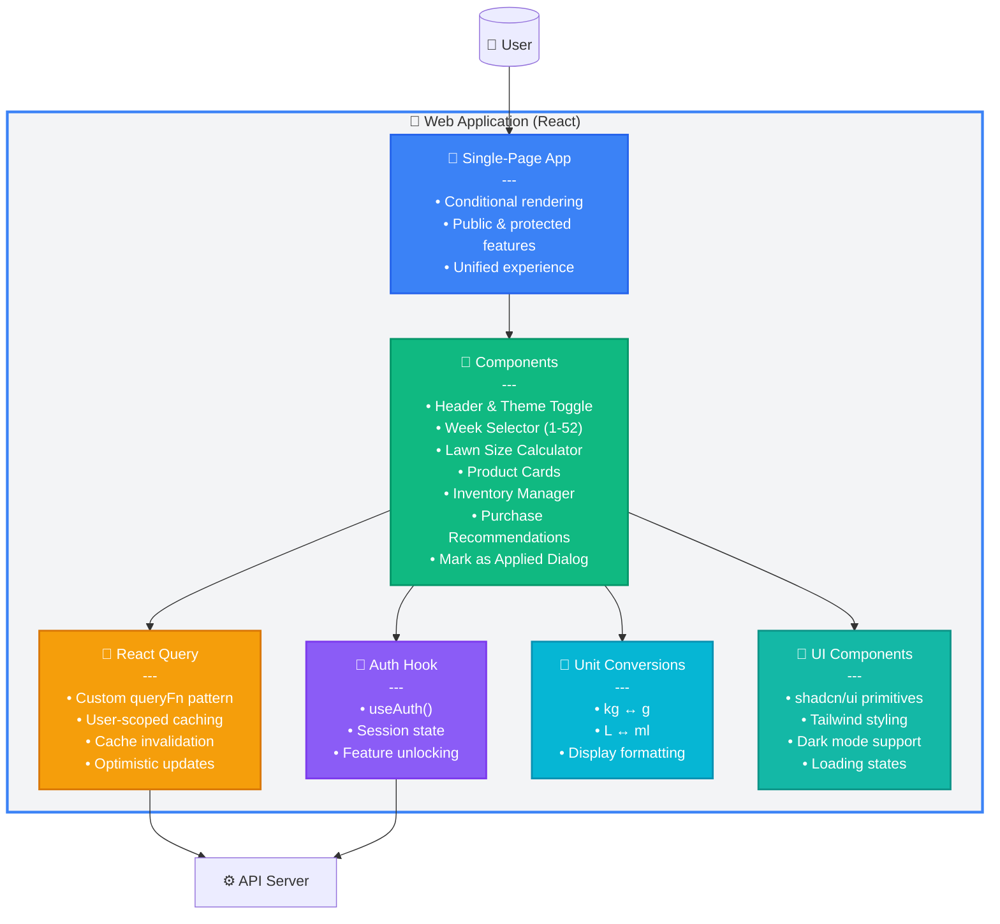
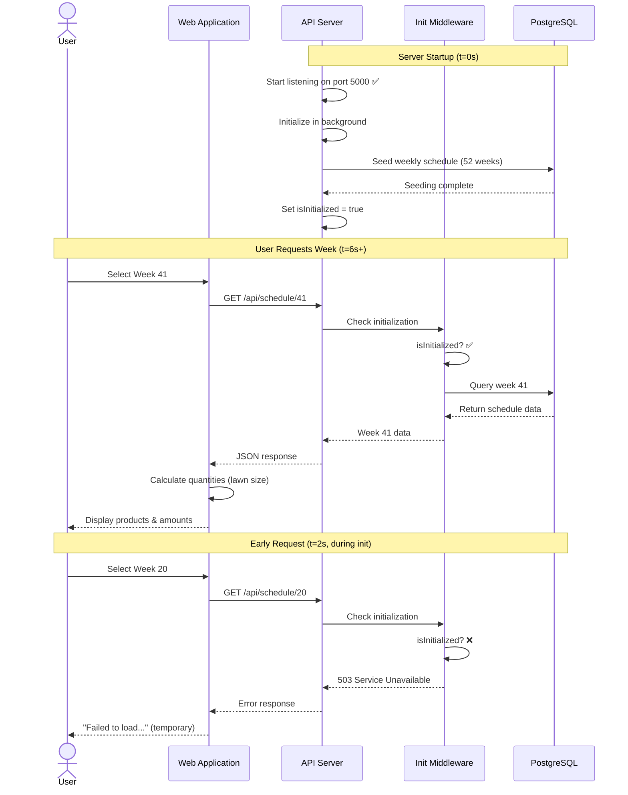
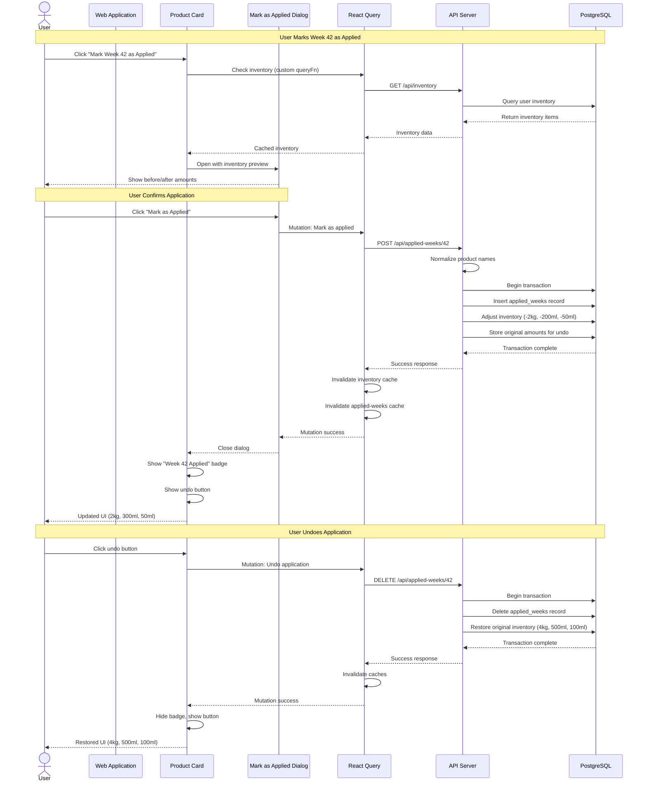
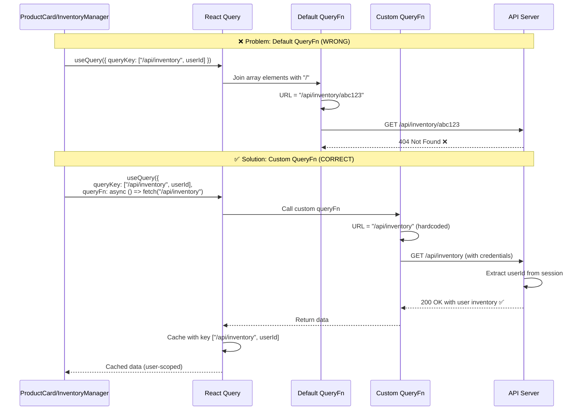

# C4 Architecture Diagrams - Lawn Care Application

## Level 1: System Context Diagram

**Description**: Shows the Lawn Care Application in context with its users and external dependencies. Users interact with the system to get personalized lawn care recommendations based on the official NZLA guide, with optional authentication for advanced features.

---

## Level 2: Container Diagram

**Description**: Shows the high-level technical containers that make up the application:
- **Web Application**: React-based SPA with Vite, handles all UI and user interactions with custom React Query pattern for user-scoped caching
- **API Server**: Express backend managing business logic, authentication, data persistence, and product name normalization
- **PostgreSQL Database**: Stores users, weekly schedules, inventory data, and applied weeks with undo support
- **Replit Auth**: External OAuth provider for secure Google SSO

---

## Level 3: Component Diagram - API Server

**Description**: Shows the internal components of the API Server:
- **Route Handlers**: Define API endpoints for schedule, lawn size, inventory, applied weeks, and user data
- **Auth Middleware**: Validates sessions and protects authenticated routes
- **Initialization Middleware**: Prevents race conditions by gating schedule requests until seeding completes
- **Product Name Normalizer**: Ensures consistent product naming across all operations
- **Storage Interface**: Abstraction layer for all database operations with unit conversion support
- **Startup Module**: Orchestrates background initialization after server starts
- **Schedule Seeder**: Pre-loads all 52 weeks of NZLA application data with per-product types
- **Drizzle ORM**: Type-safe database access layer

---

## Level 3: Component Diagram - Web Application

**Description**: Shows the internal structure of the React Web Application:
- **Single-Page App**: Unified page with conditional rendering for public/protected features
- **Components**: Comprehensive lawn care feature components including inventory and application tracking
- **Auth Hook**: Manages authentication state and feature unlocking
- **React Query**: Custom queryFn pattern for user-scoped caching and cache invalidation
- **Unit Conversions**: Bidirectional conversions between metric units
- **UI Components**: shadcn/ui component library with Tailwind CSS and dark mode

---

## Data Flow Diagram - Weekly Schedule Retrieval

**Description**: Shows the complete flow of retrieving weekly schedule data, including the deployment race condition prevention with initialization gating.

---

## Data Flow Diagram - Mark as Applied with Inventory Adjustment

**Description**: Shows the complete flow of marking a week as applied, including inventory adjustment with undo support. Highlights the custom queryFn pattern, cache invalidation, and transactional database operations.

---

## Data Flow Diagram - React Query Custom QueryFn Pattern

**Description**: Illustrates the critical React Query custom queryFn pattern that fixes URL construction issues while maintaining user-scoped cache keys for security and proper cache invalidation.

---

## Key Architectural Decisions

### 1. **Single-Page Application with Conditional Rendering**
- All features on one page (/)
- Public features: Week selector, lawn size calculator (local state), product recommendations
- Protected features: Inventory management, purchase recommendations, mark as applied
- Features unlock seamlessly after authentication
- No page navigation required

### 2. **Custom React Query Pattern for User-Scoped Caching**
- **Problem**: Default queryFn joins ALL cache key array elements with "/" to build URLs
- **Impact**: `["/api/inventory", userId]` → `/api/inventory/123` (404 error)
- **Solution**: Custom queryFn explicitly constructs correct URL while keeping userId in cache key
- **Applied in**: ProductCard (inventory + applied-weeks), InventoryManager, PurchaseRecommendations
- **Security**: User ID in cache key prevents cross-user data leakage
- **Pattern**: `queryFn: async () => fetch("/api/endpoint", { credentials: "include" })`

### 3. **Product Name Normalization**
- Canonical product names defined in `shared/canonicalProductNames.ts`
- Normalization handles: case-insensitivity, "NZLA" prefix variations, "Plus" vs "+"
- Applied across: inventory operations, weekly applications, purchase recommendations
- Database migration script ensures historical data consistency
- One inventory entry per product per user (database constraint)

### 4. **Mark as Applied with Undo Support**
- Transactional inventory adjustments (kg↔g, L↔ml conversions)
- Stores original inventory amounts for accurate undo restoration
- "Store zero" design: insufficient inventory sets to 0 (not negative)
- Conditional rendering: button replaced by badge when applied
- Cache invalidation ensures immediate UI updates across all components

### 5. **Race Condition Prevention**
- Server starts immediately (passes health checks)
- Schedule seeding runs in background
- Middleware gates schedule endpoints with 503 until ready
- Prevents serving empty data during deployment
- Idempotent upsert operations (safe restarts)

### 6. **Authentication Strategy**
- Replit Auth (OIDC) for Google SSO
- Server-side sessions in PostgreSQL
- Session-based user identification (not client-provided IDs)
- Client-side feature unlocking (no route redirects)
- All protected routes validate session server-side

### 7. **Unit Conversion System**
- Bidirectional conversions: kg↔g, L↔ml
- Display formatting for user-friendly units
- Backend stores user's original units
- Consistent conversion logic shared across frontend/backend
- Preserves precision during undo operations

### 8. **Cache Security and Invalidation**
- All user-scoped queries include user ID in cache key
- Prevents cross-user data leakage
- Invalidation after mutations: inventory, applied weeks
- Optimistic updates for responsive UX
- Custom queryFn maintains security while fixing URL construction

### 9. **Database Schema Design**
- Weekly Schedule: 52 weeks pre-seeded with per-product types
- Inventory: Unique constraint per user per product
- Applied Weeks: Stores week number, user ID, and adjustment details for undo
- Canonical product names ensure referential integrity
- PostgreSQL constraints prevent duplicate applications

### 10. **Scalability Considerations**
- Serverless PostgreSQL (Neon)
- Stateless API server (session store in DB)
- Client-side caching with React Query
- Background initialization doesn't block startup
- User-scoped data isolation for horizontal scaling
