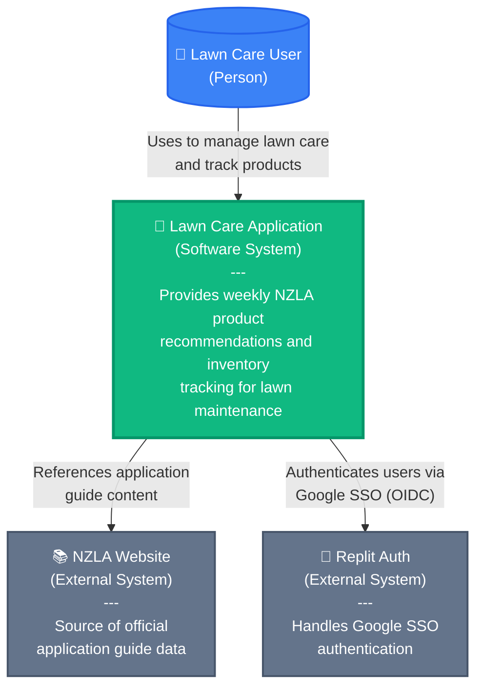
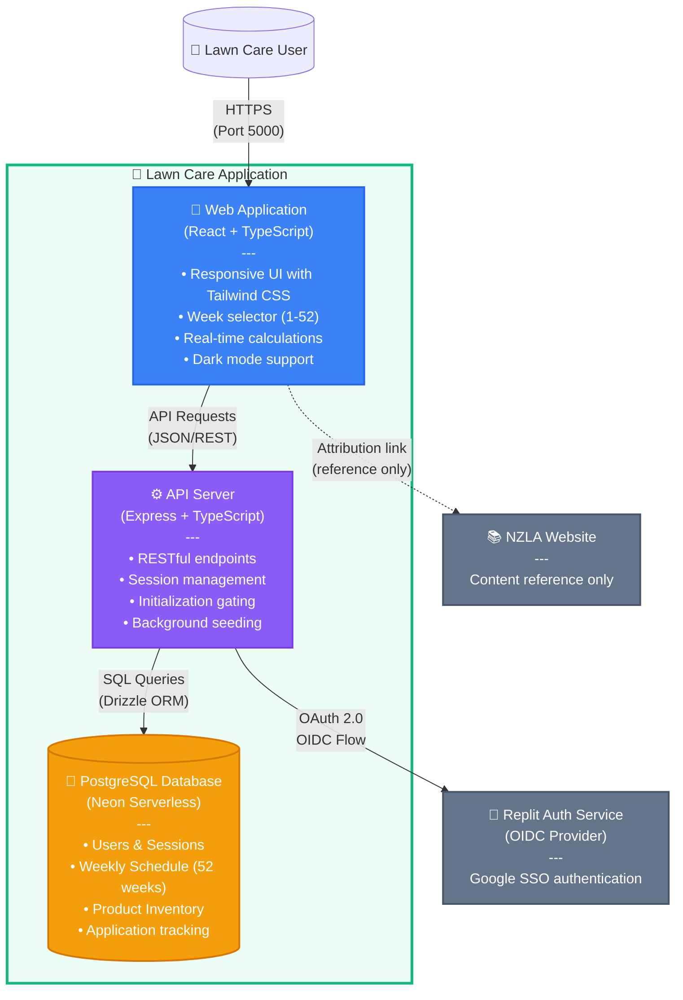
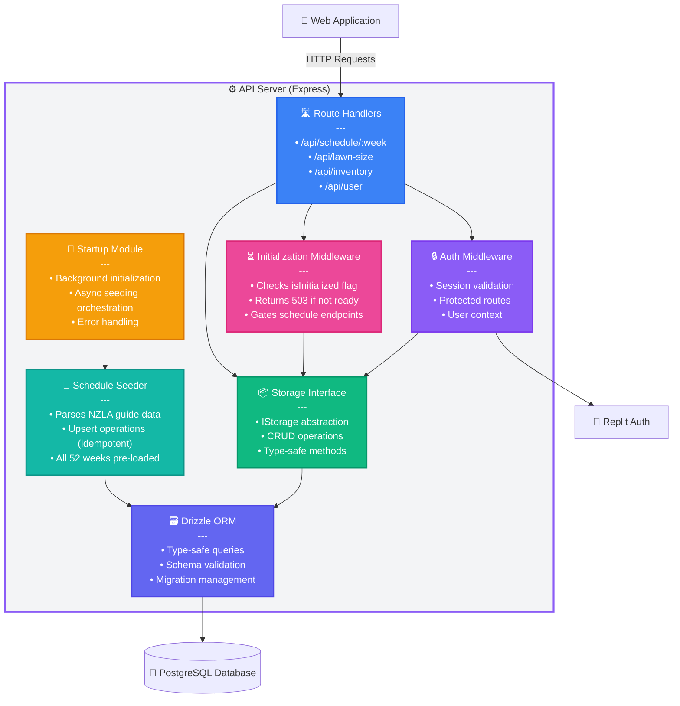
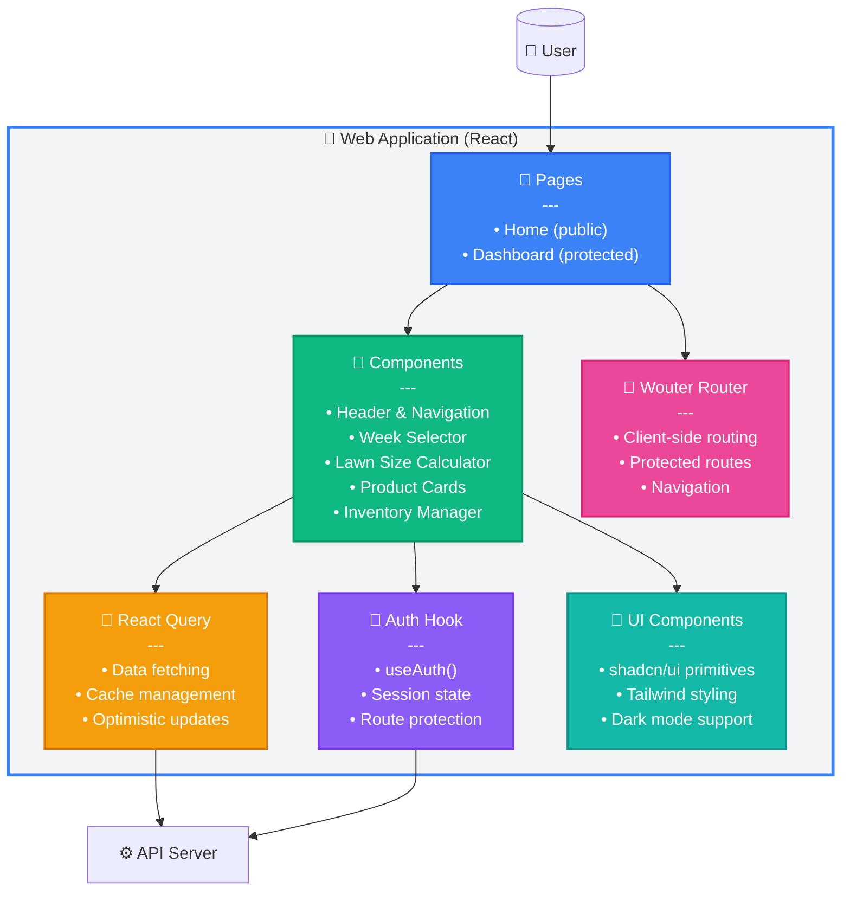
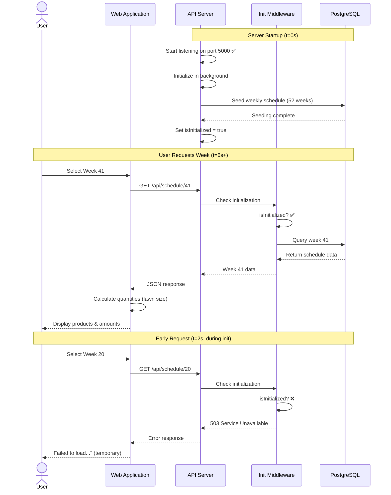

# C4 Architecture Diagrams - Lawn Care Application

## Level 1: System Context Diagram

**Description**: Shows the Lawn Care Application in context with its users and external dependencies. Users interact with the system to get personalized lawn care recommendations based on the official NZLA guide, with optional authentication for advanced features.

---

## Level 2: Container Diagram

**Description**: Shows the high-level technical containers that make up the application:
- **Web Application**: React-based SPA with Vite, handles all UI and user interactions
- **API Server**: Express backend managing business logic, authentication, and data persistence
- **PostgreSQL Database**: Stores users, weekly schedules, and inventory data
- **Replit Auth**: External OAuth provider for secure Google SSO

---

## Level 3: Component Diagram - API Server

**Description**: Shows the internal components of the API Server:
- **Route Handlers**: Define API endpoints for schedule, lawn size, inventory, and user data
- **Auth Middleware**: Validates sessions and protects authenticated routes
- **Initialization Middleware**: Prevents race conditions by gating schedule requests until seeding completes
- **Storage Interface**: Abstraction layer for all database operations
- **Startup Module**: Orchestrates background initialization after server starts
- **Schedule Seeder**: Pre-loads all 52 weeks of NZLA application data
- **Drizzle ORM**: Type-safe database access layer

---

## Level 3: Component Diagram - Web Application

**Description**: Shows the internal structure of the React Web Application:
- **Pages**: Home (public) and Dashboard (protected) route components
- **Components**: Reusable UI elements for lawn care features
- **Auth Hook**: Manages authentication state and route protection
- **React Query**: Handles server state synchronization and caching
- **Wouter Router**: Lightweight client-side routing
- **UI Components**: shadcn/ui component library with Tailwind CSS

---

## Data Flow Diagram - Weekly Schedule Retrieval

**Description**: Shows the complete flow of retrieving weekly schedule data, including the deployment race condition prevention with initialization gating.

---

## Key Architectural Decisions

### 1. **Tiered Access Model**
- **Public**: Home page with basic calculator (local state)
- **Protected**: Dashboard with persistent storage and inventory

### 2. **Race Condition Prevention**
- Server starts immediately (passes health checks)
- Schedule seeding runs in background
- Middleware gates schedule endpoints with 503 until ready
- Prevents serving empty data during deployment

### 3. **Data Pre-seeding**
- All 52 weeks loaded at startup
- Idempotent upsert operations (safe restarts)
- Database-driven scheduler (not hardcoded)

### 4. **Authentication Strategy**
- Replit Auth (OIDC) for Google SSO
- Server-side sessions in PostgreSQL
- Client-side route guards

### 5. **Frontend Architecture**
- React Query for server state
- Local state for public features
- Optimistic updates for inventory

### 6. **Scalability Considerations**
- Serverless PostgreSQL (Neon)
- Stateless API server
- Client-side caching
- Background initialization
